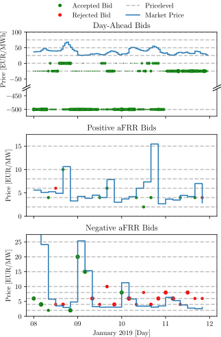
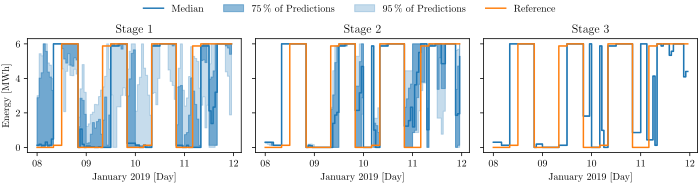

# PyPSA-stochUC

PyPSA-stochUC is an open source stochastic unit commitment optimization tool available on GitHub. 
It provides a modular extension for the Python for Power System Analysis (PyPSA) framework [[Brown et al., 2018]](#2), offering market and bidding mechanisms, stochastic optimization, and multistaging capabilities. 

This code was used to create the example in [Welfonder et al., 2024](#1).
To improve usability the code will be updated in the future.
The original code used in the paper can still be found under the tag [v1.0-alpha](https://github.com/PPGS-Tools/PyPSA-stochUC/releases/tag/v1.0-alpha).
We are currently working on a new version of the code, to make it compatible with the latest version of PyPSA and to improve the usability.
In particular, we switch from the old Pyomo implementation to the new Linopy implementation.
This version can be found on the [Linopy branch](https://github.com/PPGS-Tools/PyPSA-stochUC/tree/linopy) and is a work in progress version.
The Linopy version does not yet feature the full functionality, but is already compatible with the latest version of PyPSA.
An workin example of the Linopy version can be found in the [Linopy example](https://github.com/PPGS-Tools/PyPSA-stochUC/blob/linopy/example.ipynb).
The version on the main branch is still written in Pyomo and features the whole functionality of the original code.


In the example the tool was used for unit commitment optimization for a waste-to-energy plant with heat storage and a battery energy storage system in Germany. 
The example takes uncertain day-ahead and balancing power (aFRR) market prices, as well as heat load uncertainty into account. 
With PyPSA-stochUC, users can efficiently analyze and optimize power system operations under uncertain conditions.

## Installation
Create a virtual environment
```sh
python -m venv .env
```
Activate the virtual environment
```sh
source .env/bin/activate
```
Install the dependencies
```sh
pip install -r requirements.txt
```

## Usage
```sh
python MultistageOpt.py
```
This script will run the example, shown in [Welfonder et al., 2024](#1).
It performs a stochastic unit commitment optimization for a waste-to-energy plant with heat storage and a battery energy storage system in Germany.
This is done, using a rolling horizon and multistaging.
New forecasts are created for each stage and each day.
The results are written into the directory `Results/`.
The results include the optimal bids on the day-ahead and aFRR market.

A more detailed usage can be seen in the [example](https://github.com/PPGS-Tools/PyPSA-stochUC/blob/linopy/example.ipynb) on the Linopy Branch.



The results also include the corresponding optimal states of each component of the powerplant for each stage and scenario.
Here for example the state of charge of the battery energy storage system.



## Historical Data
The example in [Welfonder et al., 2024](#1) was created based on historical data.
The following timeseries were used in the example:
- [day-ahead electricity prices (ENTSO-E)](https://transparency.entsoe.eu/transmission-domain/r2/dayAheadPrices/show?name=&defaultValue=false&viewType=TABLE&areaType=BZN&atch=false&dateTime.dateTime=23.05.2024+00:00|UTC|DAY&biddingZone.values=CTY|10Y1001A1001A83F!BZN|10Y1001A1001A82H&resolution.values=PT60M&dateTime.timezone=UTC&dateTime.timezone_input=UTC),
- [capacity price for aFRR (german TSOs)](https://www.regelleistung.net/apps/datacenter/tendering-files/?productTypes=aFRR&markets=CAPACITY&fileTypes=RESULTS&dateRange=2018-01,2024-04),
- district heat demand of the power plant,
- [outdoor temperature near the power plant (german weather service)](https://opendata.dwd.de/climate_environment/CDC/observations_germany/climate/10_minutes/air_temperature/historical/), 
- [load forecast (ENTSO-E)](https://transparency.entsoe.eu/load-domain/r2/totalLoadR2/show?name=&defaultValue=false&viewType=TABLE&areaType=BZN&atch=false&dateTime.dateTime=23.05.2024+00:00|UTC|DAY&biddingZone.values=CTY|10Y1001A1001A83F!BZN|10Y1001A1001A82H&dateTime.timezone=UTC&dateTime.timezone_input=UTC) and
- [generation forecast of solar and wind power plants (ENTSO-E)](https://transparency.entsoe.eu/generation/r2/dayAheadGenerationForecastWindAndSolar/show?name=&defaultValue=false&viewType=TABLE&areaType=BZN&atch=false&dateTime.dateTime=23.05.2024+00:00|UTC|DAYTIMERANGE&dateTime.endDateTime=23.05.2024+00:00|UTC|DAYTIMERANGE&area.values=CTY|10Y1001A1001A83F!BZN|10Y1001A1001A82H&productionType.values=B16&productionType.values=B18&productionType.values=B19&processType.values=A01&dateTime.timezone=UTC&dateTime.timezone_input=UTC).

Access to most of this data is public.
Since the data of the district heat demand of the power plant was taken from internal data, it can not be published.

Insted for example a [generic district heat demand](https://gitlab.com/hotmaps/load_profile/load_profile_residential_heating_generic/-/blob/95072c85756627ecfc8448ffd1c11fe844c5fc64/data/hotmaps_task_2.7_load_profile_residential_heating_generic.csv) could be used.

## References
<a id="1">Welfonder, T., Lips, J., Gmur, A., & Lens, H. (2024)</a>. An Open Source Stochastic Unit Commitment Tool using the PyPSA-Framework. 12th IFAC Symposium on Control of Power and Energy Systems - CPES 2024: Rabat, Morocco. https://doi.org/10.1016/j.ifacol.2024.07.485

<a id="2">Brown, T., Hörsch, J., Hofmann, F., Neumann, F., Zeyen, L., Syranidis, C., Frysztacki, M., Schlachtberger, D., Glaum, P., & Parzen, M. (2018)</a>. PyPSA: Python for Power System Analysis (Version 0.28.0) [Computer software]. https://doi.org/10.5334/jors.188
